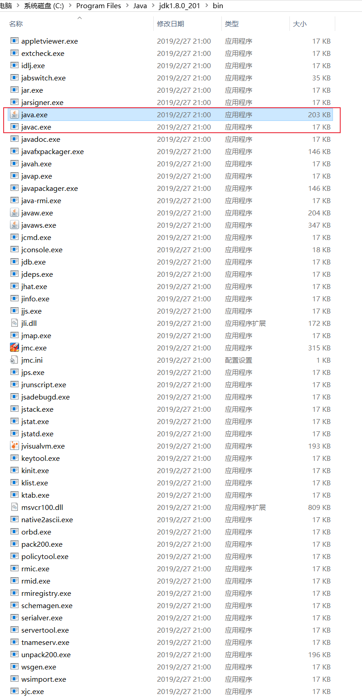

# Java

Java是一门面向对象编程语言，不仅吸收了C++语言的各种优点，还摒弃了C++里难以理解的多继承、指针等概念，因此Java语言具有功能强大和简单易用两个特征。

Java语言作为静态面向对象编程语言的代表，极好地实现了面向对象理论，允许程序员以优雅的思维方式进行复杂的编程。

Java具有简单性、面向对象、分布式、健壮性、安全性、平台独立与可移植性、多线程、动态性等特点。

Java可以编写桌面应用程序、Web应用程序、分布式系统和嵌入式系统应用程序等

### Java发展历程


1995由Sun公司推出，2009被Oracle收购。

### Java平台应用


### 核心概念：JVM/JDK/JRE

> [!TIP|label:JVM|style:flat]

> Java Virtual Machine


> [!TIP|label:JDK|style:flat]

> Java Development Kit (Java开发工具包)


> [!TIP|label:JRE|style:flat]

> Java Runtime Environment (Java运行时环境)

### Java 开发环境搭建

1、安装JDK

https://www.oracle.com/technetwork/java/javase/downloads/index.html

JDK8

https://www.oracle.com/technetwork/java/javase/downloads/jdk8-downloads-2133151.html

> [!TIP|style:flat]

> Java库文件，以 `.jar` 结尾

bin目录文件：



lib目录文件：


2、window 10 配置环境变量（系统变量）

```bash
# 配置JDK安装路径
JAVA_HOME
C:\Program Files\Java\jdk1.8.0_172

# 配置类库文件的位置
CLASSPATH
.;%JAVA_HOME%\lib\dt.jar;%JAVA_HOME%\lib\tools.jar

# 配置JDK命令文件的位置
path
C:\ProgramFiles\Java\jdk1.8.0_172\bin
C:\Program Files\Java\jdk1.8.0_172\bin\jre\bin
```

测试配置是否成功：


3、Mac

直接装`jdk-8u201-macosx-x64.dmg`就可以了。

### 使用工具开发Java程序


HelloWorld.java

```java
public class HelloWorld {
  public static void main(String[] args) {
    System.out.println("Welcome to Java world.");
  }
}
```

使用bash，找到文件路径，执行

```bash
javac HelloWorld.java
```

此时，会在当前位置生产一个HelloWorld.class的字节码文件。

```bash
# 执行字节码文件，注意不能跟后缀名.class
java HelloWorld
# Welcome to Java world.
```

### 使用IDE开发

集成开发环境（IDE）是一类软件

将程序开发环境和程序调试环境集合在一起，提高开发效率。

#### Eclipse

开源免费的。下载地址 https://www.eclipse.org/downloads/

#### MyEclipse

MyEclipse是对Eclipse的扩展，是一个十分优秀的用于开发Java、JavaEE的Eclipse插件集合。

https://www.myeclipsecn.com

### 开发流程

以Eclipse为例

#### 1 创建Java项目

```
file -> New -> Java Project
# Project name: hello
```

#### 2 创建程序包

```
# src 目录
New -> Package
# com.hello
```

#### 3 编写Java源程序

```
com.hello -> New -> Class > Name: HelloTest
```

> IDE自动生成：HelloTest.java

```java
package com.hello;

public class HelloTest {

}
```

> [!WARNING|style:flat|label:注意]

> 类名 `class HelloTest` 一定要与文件名 `HelloTest.java` 相同。

如下图：


#### 4 运行Java程序

```
代码编辑拦，空白处鼠标右键 -> Run As -> Java Application ...
```


或者点击编辑器左上角的"播放"图标，run ...

### 程序的移植

从公司拷回屋里继续写...

```
拷贝项目代码
-> 到家，开电脑，打开软件
-> File
-> Import
-> General/Existing Project into Workspace
-> Next
-> Select root directory: [Broser]
-> 找到文件
-> Finish
```

### 来自巨人的经验

多练、多问、自己动手，调试错误、复习和总结。

```
Java中泛型的本质
Java中静态变量的适用场景
Java类加载原理及类加载器
Java中对Clone的理解
Java中HashMap的实现
Java中Collection和Collections的区别
Java数组浅析
Java代码优化编程
Java事件处理机制与“恋爱关系”
Java中的JNDI（Java命令与目录接口）
Java中Comparable和Comparator实现对象比较
Java中String和StringBuffer的区别
Java中反射机制
Java中的synchronized
```

学虽容易，学好不易，且学且珍惜。

### 原教程出处

https://www.imooc.com/learn/85

