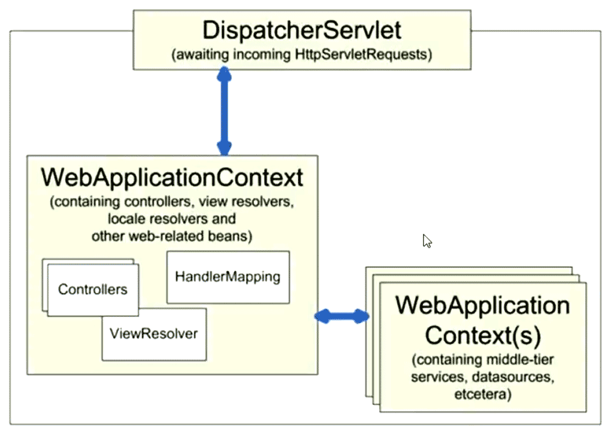

# Spring MVC实操

### 从配置文件开始

src/main/webapp/WEB-INF/web.xml

```xml
<!-- 
	Maven自动生成使用的2.3版本的标准，该标准默认会将jsp页面的el表达式语言关闭
-->
<!--
<!DOCTYPE web-app PUBLIC
 "-//Sun Microsystems, Inc.//DTD Web Application 2.3//EN"
 "http://java.sun.com/dtd/web-app_2_3.dtd" >
-->
<?xml verrsion="1.0" encoding="UTF-8"?>
<web-app version="2.4" xmlns="http://java.sun.com/xml/ns/j2ee"
	xmlns:xsi="http://www.w3.org/2001/XMLSchema-instance"
	xsi:schemaLocation="http://java.sun.com/xml/ns/j2ee
		http://java.sun.com/xml/ns/j2ee/web-app_2_4.xsd">
		
  <display-name>Spring MVC DEMO</display-name>
  
  <!-- Spring应用上下文，理解层次化的ApplicationContext -->
  <context-param>
  	<param-name>contextConfigLocation</param-name>
  	<param-value>/WEB-INF/configs/spring/applicationContext*.xml</param-value>
  </context-param>
  
  <listener>
  	<listener-class>
  		org.springframework.web.context.ContextLoaderListener
  	</listener-class>
  </listener>
  
  <!-- DispatcherServlet, Spring MVC的核心 -->
  <servlet>
  	<servlet-name>mvc-dispatcher</servlet-name>
  	<servlet-class>org.springframework.web.servlet.DispatcherServlet</servlet-class>
  	<!-- DispatcherServlet对应的上下文配置，默认为/WEB-INF/$servlet-name$-servlet.xml -->
  	<!-- 以下配置，改变默认参数 -->
  	<init-param>
  		<param-name>contextConfigLocation</param-name>
  		<param-value>/WEB-INF/configs/spring/mvc-dispatcher-servlet.xml</param-value>
  	</init-param>
  	<load-on-startup>1</load-on-startup>
  </servlet>
  
  <servlet-mapping>
  	<servlet-name>mvc-dispatcher</servlet-name>
  	<!-- mvc-dispatcher拦截所有的请求  -->
  	<url-pattern>/</url-pattern>
  </servlet-mapping>
  
</web-app>
```

**Spring MVC的上下文层级**



src/main/webapp/WEB-INF/configs/spring/mvc-dispatcher-servlet.xml

```xml
<?xml version="1.0" encoding="UTF-8"?>
<beans xmlns="http://www.springframework.org/schema/beans"
   xmlns:xsi="http://www.w3.org/2001/XMLSchema-instance"
   xmlns:context="http://www.springframework.org/schema/context"
   xmlns:mvc="http://www.springframework.org/schema/mvc"
   xsi:schemaLocation="
   	http://www.springframework.org/schema/beans 
   	http://www.springframework.org/schema/beans/spring-beans.xsd
   	http://www.springframework.org/schema/context
   	http://www.springframework.org/schema/context/spring-context.xsd
   	http://www.springframework.org/schema/mvc
   	http://www.springframework.org/schema/mvc/spring-mvc.xsd">
   	
   	<!-- 本配置文件是工名为mvc-dispatcher的DispatcherServlet使用，提供其相关的Spring MVC配置 -->
   	
	<!-- 启用Spring基于annotation的DI，使用户可以在Spring MVC中使用Spring的强大功能。
		激活 @Required @Autowired,JSR 250's @PostConstruct, @PreDestroy and @Resource等标注 
	-->
	<context:annotation-config/>
	
	<!-- DispatcherServlet上下文，只管理@Controller类型的bean，忽略其他类型的bean，如@Service -->
	<context:component-scan base-package="com.test.mvcdemo">
		<context:include-filter type="annotation" expression="org.springframework.stereotype.Controller"/>
	</context:component-scan>
	
	<!-- HandlerMapping，无需配置，Spring MVC可以默认启动。即默认会启动：
		DefaultAnnotationHandlerMapping annotation-driven HandlerMapping
	-->

	<!-- 扩充了注解驱动，可以将请求参数绑定到控制器参数
		Url中的查询参数，可以直接映射到Controller中某个输入方法的参数
	 -->
	<mvc:annotation-driven/>
	
	<!-- 静态资源处理，css、js、images -->
	<mvc:resources mapping="/resources/**" location="/resources/"/>
	
	<!-- 配置ViewResolver
		可以用多个ViewResolver
		使用order属性排序
		InternalResourceViewResolve放在最后
	-->
	<bean class="org.springframework.web.servlet.view.InternalResourceViewResolver">
		<property name="viewClass" value="org.springframework.web.servlet.view.JstlView"/>
		<property name="prefix" value="/WEB-INF/jsps/"/>
		<property name="suffix" value=".jsp"/>
	</bean>
	
</beans>
```

### 源码

codes/spring-mvc-demo1