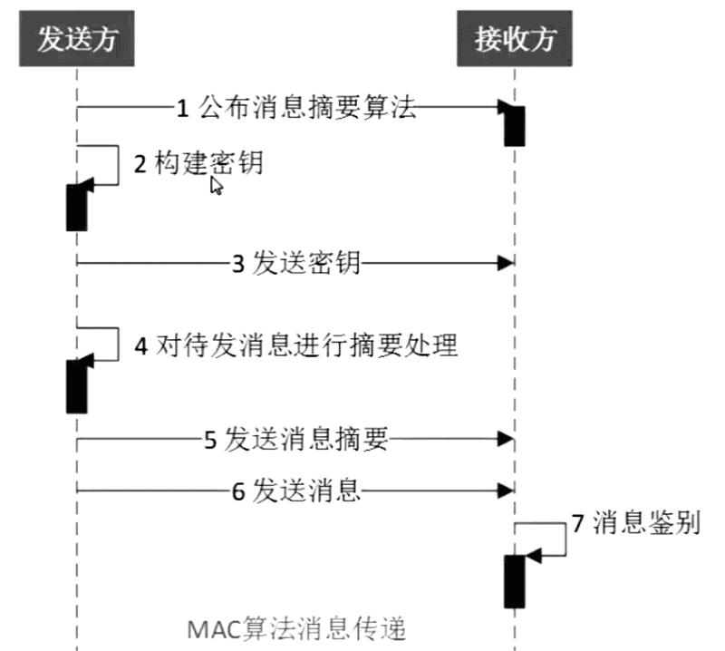

# 消息摘要算法--MAC

MAC(Message Authentication Code)

HMAC(keyed-Hash Message Authentication Code),含有密钥的散列函数算法

### 融合MD、SHA

- MD系列：HmacMD2、HmacMD4、HmacMD5

- SHA系列：HmacSHA1、HmacSHA224、HmacSHA256、HmacSHA384、HmacSHA512

应用：SecureCRT

|算法|摘要长度|实现方法|
|:--|:--|:--|
|HmacMD2|128|Bouncy Castle|
|HmacMD4|128|Bouncy Castle|
|HmacMD5|128|JDK|
|HmacSHA1|160|JDK|
|HmacSHA224|224|Bouncy Castle/JDK1.8|
|HmacSHA256|256|JDK|
|HmacSHA384|384|JDK|
|HmacSHA512|512|JDK|

### 代码实现

```java
package md.test;

import javax.crypto.KeyGenerator;
import javax.crypto.Mac;
import javax.crypto.SecretKey;
import javax.crypto.spec.SecretKeySpec;

import org.apache.commons.codec.binary.Hex;
import org.bouncycastle.crypto.Digest;
import org.bouncycastle.crypto.digests.MD2Digest;
import org.bouncycastle.crypto.digests.MD4Digest;
import org.bouncycastle.crypto.digests.MD5Digest;
import org.bouncycastle.crypto.digests.SHA1Digest;
import org.bouncycastle.crypto.digests.SHA224Digest;
import org.bouncycastle.crypto.digests.SHA256Digest;
import org.bouncycastle.crypto.digests.SHA384Digest;
import org.bouncycastle.crypto.digests.SHA512Digest;
import org.bouncycastle.crypto.macs.HMac;
import org.bouncycastle.crypto.params.KeyParameter;

/**
 * keyed-Hash Message Authentication Code
 * @author Capricorncd
 * https://github.com/capricorncd
 */
public class TestMAC {

	private static final String HMAC_MD2 = "HmacMD2";
	private static final String HMAC_MD4 = "HmacMD4";
	private static final String HMAC_MD5 = "HmacMD5";

	private static final String HMAC_SHA = "HmacSHA1";
	private static final String HMAC_SHA_224 = "HmacSHA224";
	private static final String HMAC_SHA_256 = "HmacSHA256";
	private static final String HMAC_SHA_384 = "HmacSHA384";
	private static final String HMAC_SHA_512 = "HmacSHA512";

	public static void main(String[] args) {
		String src = "keyed-Hash Message Authentication Code";
		// secret key, length = 10.
		String secretKey = "aaaaaaaaaa";
		byte[] secretKeyBytes = org.bouncycastle.util.encoders.Hex.decode(secretKey);

		jdkHmac(src, HMAC_MD2, secretKeyBytes);
		jdkHmac(src, HMAC_MD4, secretKeyBytes);
		jdkHmac(src, HMAC_MD5, secretKeyBytes);

		println();
		bcHmac(src, HMAC_MD2, new MD2Digest(), secretKeyBytes);
		bcHmac(src, HMAC_MD4, new MD4Digest(), secretKeyBytes);
		bcHmac(src, HMAC_MD5, new MD5Digest(), secretKeyBytes);

		println();
		jdkHmac(src, HMAC_SHA, secretKeyBytes);
		jdkHmac(src, HMAC_SHA_224, secretKeyBytes);
		jdkHmac(src, HMAC_SHA_256, secretKeyBytes);
		jdkHmac(src, HMAC_SHA_384, secretKeyBytes);
		jdkHmac(src, HMAC_SHA_512, secretKeyBytes);

		println();
		bcHmac(src, HMAC_SHA, new SHA1Digest(), secretKeyBytes);
		bcHmac(src, HMAC_SHA_224, new SHA224Digest(), secretKeyBytes);
		bcHmac(src, HMAC_SHA_256, new SHA256Digest(), secretKeyBytes);
		bcHmac(src, HMAC_SHA_384, new SHA384Digest(), secretKeyBytes);
		bcHmac(src, HMAC_SHA_512, new SHA512Digest(), secretKeyBytes);
	}

	/**
	 * JDK HMAC
	 * @param src source
	 * @param algorithm
	 * @param secretKeyBytes secret key bytes
	 */
	public static void jdkHmac(String src, String algorithm, byte[] secretKeyBytes) {
		String result = null;
		try {
			// restore secret key
			SecretKey restoreSecretKey = new SecretKeySpec(secretKeyBytes, algorithm);
			// instance MAC
			Mac mac = Mac.getInstance(restoreSecretKey.getAlgorithm());
			// initial MAC
			mac.init(restoreSecretKey);
			// run
			byte[] resultBytes = mac.doFinal(src.getBytes());
			result = Hex.encodeHexString(resultBytes);
		} catch (Exception e) {
			// e.printStackTrace();
			result = e.getMessage();
		}
		println(algorithm + ":", result, "by JDK");
	}

	/**
	 * JDK HMAC
	 * Automatically generate a secret key
	 * @param src
	 * @param algorithm
	 */
	public static void jdkHmac(String src, String algorithm) {
		try {
			// Automatically generate a secret key
			// initial KeyGenerator
			KeyGenerator keyGenerator = KeyGenerator.getInstance(algorithm);
			// create secret key
			SecretKey secretKey = keyGenerator.generateKey();
			// get secret key
			byte[] secretKeyBytes = secretKey.getEncoded();

			jdkHmac(src, algorithm, secretKeyBytes);
		} catch (Exception e) {
			// e.printStackTrace();
			println(algorithm + ":", e.getMessage(), "by JDK");
		}

	}

	/**
	 * bouncy castle HMAC
	 * @param <T> Digest
	 * @param src source
	 * @param algorithm
	 * @param digest Digest
	 * @param secretKeyBytes secret key bytes
	 */
	public static <T extends Digest> void bcHmac(String src, String algorithm, T digest, byte[] secretKeyBytes) {
		HMac hmac = new HMac(digest);
		// byte[] secretKeyBytes = org.bouncycastle.util.encoders.Hex.decode("aaaaaaaaaa");
		hmac.init(new KeyParameter(secretKeyBytes));

		byte[] srcBytes = src.getBytes();
		hmac.update(srcBytes, 0, srcBytes.length);

		byte[] resultBytes = new byte[hmac.getMacSize()];
		hmac.doFinal(resultBytes, 0);

		String result = org.bouncycastle.util.encoders.Hex.toHexString(resultBytes);
		println(algorithm + ":", result, "by Bouncy Castle.");
	}

	/**
	 * System.out.println
	 *
	 * @param args
	 */
	public static void println(Object... args) {
		for (Object o : args) {
			System.out.print(o + " ");
		}
		System.out.print("\n");
	}
}
```

运行结果：

```
HmacMD2: Algorithm HmacMD2 not available by JDK
HmacMD4: Algorithm HmacMD4 not available by JDK
HmacMD5: 60abad09ecbc7f234c3066b76209d657 by JDK

HmacMD2: cc2e396c39d58f3d6415eebfbf928744 by Bouncy Castle.
HmacMD4: 199828516cc1f41baa9536e095e73483 by Bouncy Castle.
HmacMD5: 60abad09ecbc7f234c3066b76209d657 by Bouncy Castle.

HmacSHA1: ee77ed44862c69ff1b93d81a2cab40b714aeac39 by JDK
HmacSHA224: 261be450a5b2f6e9dad0df89e14710c4a412ef89d4c9b8db76173c19 by JDK
HmacSHA256: a6c974f0b1025844d8266e3ab8f0402c8467c5878dcd9982216c46b6fd90d067 by JDK
HmacSHA384: 43a6703c1fa097ec80a1aec85b6f38eef34059c3b90dddce27c7fde3d5e7d716050a86aa09275b52c9378eb819774a32 by JDK
HmacSHA512: da98cf562dfaa094624ee28464dd0c4e0ade2a07fc28bb5b5aadeb0cef59e43ec9a3eeef51cf33a6e30c1611e1dc912fac3f1108db15a72e390e47579e4dad23 by JDK

HmacSHA1: ee77ed44862c69ff1b93d81a2cab40b714aeac39 by Bouncy Castle.
HmacSHA224: 261be450a5b2f6e9dad0df89e14710c4a412ef89d4c9b8db76173c19 by Bouncy Castle.
HmacSHA256: a6c974f0b1025844d8266e3ab8f0402c8467c5878dcd9982216c46b6fd90d067 by Bouncy Castle.
HmacSHA384: 43a6703c1fa097ec80a1aec85b6f38eef34059c3b90dddce27c7fde3d5e7d716050a86aa09275b52c9378eb819774a32 by Bouncy Castle.
HmacSHA512: da98cf562dfaa094624ee28464dd0c4e0ade2a07fc28bb5b5aadeb0cef59e43ec9a3eeef51cf33a6e30c1611e1dc912fac3f1108db15a72e390e47579e4dad23 by Bouncy Castle.
```

### MAC-应用


