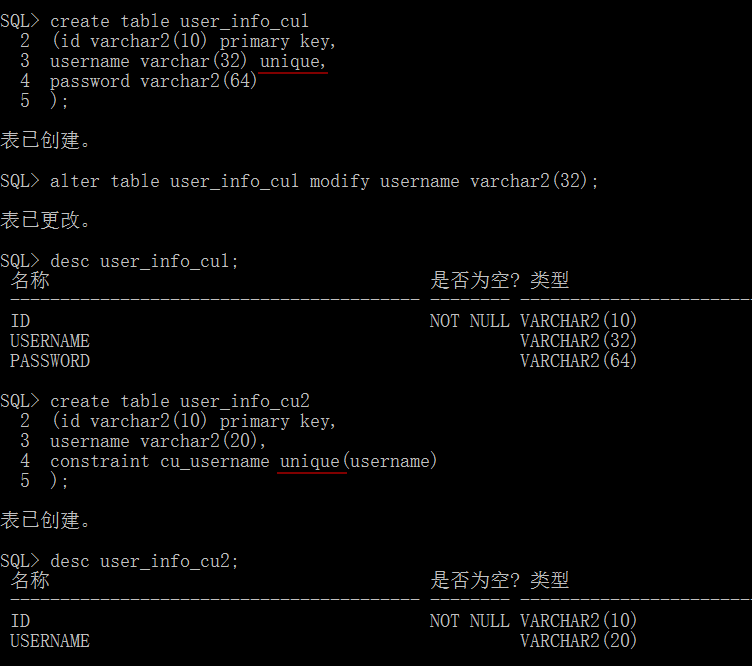

# 约束 constraint

> [!TIP|style:flat|label:约束的作用]

> 定义规则：哪些字段是必须的，哪些字段该输入什么类型的值

> 确保完整性：数据的精确性、可靠性。

非空约束、主键约束、外键约束、唯一约束、检查约束

### 非空约束

> [!TIP|style:flat|label:非空约束]

> 在创建表时，设置非空约束 `NOT NULL`

> 在修改表时，添加非空约束

> 在修改表时，去除非空约束

**在创建表时，设置非空约束**

```sql
CREATE TABLE table_name (
    column_nae datatype NOT NULL, ...
)
```

实例：

```sql
create table user_info2 (
    id number(10, 0),
    username varchar2(32) not null,
    password varchar2(64) not null
);
```

**在修改表时，添加非空约束**

```sql
ALTER TABLE table_name
MODIFY column_name datatype NOT NULL;
# 如果被修改的字段，在表中已有空值将会抛出异常
```

**在修改表时，去除非空约束**

```sql
ALTER TABLE table_name
MODIFY column_name datatype NULL;
# alter table user_info modify user_name varchar2(64) null;
```

### 主键约束

> [!TIP|style:flat|label:主键约束]

> 作用：确保表当中每一行数据的唯一性

> 一张表只能设置一个主键约束

> 主键约束可以由多个字段构成（联合主键或复合主键）

在创建表时设置主键约束、在修改表时添加主键约束、更改约束的名称、删除主键约束

**在创建表时设置主键约束**

```sql
CREATE TABLE table_name (
    column_name datatype PRIMARY KEY, ...
)
```

实例

```sql
create table user_info3 (
    id number(10, 0) primary key,
    username varchar2(32),
    password varchar2(64)
);
```

**联合主键或复合主键**

```sql
CONSTRAINT constraint_name
PRIMARY KEY(column_name1, ...)
```

```sql
create table user_info4 (
    id number(10, 0),
    username varchar2(64),
    password varchar(64),
    constraint pk_id_username primary key (id, username)
);
# pk_id_username 可任意，取合法名称都行
```


创建完成后，忘记了主键的名称，则可以通过 `user_constraints`


**在修改表时添加主键约束**

```sql
ALTER TABLE table_name
ADD CONSTRAINT constraint_name
PRIMARY KEY (column_name1, ...);
```


```sql
# 更改约束的名称constraint_name
ALTER TABLE table_name
RENAME CONSTRAINT old_name
TO new_name
```


> [!TIP|style:flat|label:删除主键约束]

> 禁用与启用

> 直接删除

```sql
# 暂时禁用，后期可能还会启用的情况
DISABLE|ENABLE CONSTRAINT constraint_name

# 禁用new_pk_id
# alter table user_info disable constraint new_pk_id;
# 查看禁用状态
# select constraint_name, status from user_constraints where table_name='USER_INFO';
```

```sql
# 直接删除1
DROP CONSTRAINT constraint_name

# alter table user_info drop constraint new_pk_id;
# 查看删除后的状态
# select constraint_name, status from user_constraints where table_name='USER_INFO';
# 结果：未选定行
```

```sql
# 直接删除2
DROP PRIMARY KEY [CASCADE]
# CASCADE 其他表引用该字段的地方，也一起删掉约束
# alter table user_info3 drop primary key;
```

### 外键约束

> [!TIP|style:flat|label:外键约束]

> 唯一一个涉及两个表当中字段关系约束。

> 又称**主从表关系**

在创建表时设置外键约束、在修改表时添加外键约束、删除外键约束

**在创建表时设置外键约束1**

```sql
CREATE TABLE table1
(
    column_name datatype REFERENCES
    table2 (column_name), ...
);
# table2 为主表
# table1 为从表
```

> [!WARNING|style:flat|label:注意]

> 设置外键约束时，主表的字段必须是主键。

> 主从表中相应字段必须是同一个数据类型。

> 从表中外键字段的值，必须来自主表中的相应字段的值，或者为null值。


**在创建表时设置外键约束2**

```sql
CONSTRAINT constraint_name FOREIGN
KEY (column_name) REFERENCES
main_table_name (column_name) [ON DELETE CASCADE]
# constraint_name通常以fk开头(FOREIGN KEY首字母)，且不能重名。
# ON DELETE CASCADE级联删除，即主表中某条数据被删除，在从表中使用了该数据的行也将被删除。从而确保主从表的完整性。
```


**在修改表时添加外键约束**

```sql
ADD CONSTRAINT constraint_name FOREIGN
KEY (column_name) REFERENCES
table_name (column_name) [ON DELETE CASCADE]
```


> [!TIP|style:flat|label:删除外键约束]

> 禁用与启用

> 直接删除

**禁用与启用**

```sql
DISABLE|ENABLE CONSTRAINT constraint_name
```


**直接删除**

```sql
DROP CONSTRAINT constraint_name;
```


### 唯一约束

> [!TIP|style:flat|label:唯一约束 UNIQUE]

> 作用：保证字段值的唯一性。

与主键约束的区别

|主键约束|唯一约束|
|:--|:--|
|主键字段值必须是非空的|允许有一个空值|
|主键在每张表中只有一个|在每张表中可以有多个|

在创建表时设置唯一约束、在修改表时添加唯一约束、删除唯一约束

```sql
# 在创建表时设置唯一约束，分列级和表级
# 列级
CREATE TABLE table_name
(column_name datatype UNIQUE, ...)

# 表级
CONSTRAINT constraint_name
UNIQUE (column_name)
# constraint_name 约束名必须是唯一的。
```



**在修改表时添加唯一约束**

```sql
ADD CONSTRAINT constraint_name
UNIQUE (column_name);
```


**删除唯一约束**

```sql
# 禁用/启用
ALTER TABLE table_name
DISABLE|ENABLE CONSTRAINT constraint_name

# 删除唯一约束
ALTER TABLE table_name
DROP CONSTRAINT constraint_name
```


### 检查约束

作用：使表中的值更具有实际意义。

一张表中可以有多个检查约束。

```
例子，员工信息：
年龄：1000 工资：-50 电话号码：080-2222-3333
# 年龄、工资不符合（没有）实际意义。
```

在创建表时设置检查约束、在修改表时添加检查约束、删除检查约束

```sql
# 在创建表时设置检查约束：列级
CREATE TABLE table_name
(column_name datatype CHECK(expressions), ...)
```


```sql
# 在创建表时设置检查约束：表级
CONSTRAINT constraint_name CHECK(expressions)
```


```sql
# 在修改表时添加检查约束
ALTER TABLE table_name
ADD CONSTRAINT constraint_name
CHECK (expressions);
```

```sql
# 禁用、启用
ALTER TABLE table_name
DISABLE|ENABLE CONSTRAINT constraint_name

# 删除检查约束
ALTER TABLE table_name
DROP CONSTRAINT constraint_name
```

### 总结

* 非空约束

* 主键约束：每张表只能有一个，可以由多个字段构成。

* 外键约束： 涉及两个表之间的关系

* 唯一约束

* 检查约束

> [!TIP|style:flat|label:具体操作]

> **在创建表时设置约束：**

> 非空约束只能在**列级**设置，不能再**表级**设置；

> 其他约束既可以在**列级**设置，也可以在**表级**设置；

> 并且设置非空约束是没有名字的。

> **在修改表时添加约束：**

> 与其他不同的还是 `非空约束`，使用的是修改字段方法 ALTER TABLE table_name MODIFY column_name datatype NOT NULL;

> **更改约束的名称：**

> 非空约束没有名称，所有不能改名；

> 其他约束可以修改约束名称；

> 通过数据字典 `user_constraints`查看约束名称、类型等信息；

> ALTER TABLE table_name RENAME CONSTRAINT old_name TO new_name;

> **删除约束：**

> 非空约束比较特殊，使用的是修改字段方法，即将NOT NULL改为可以为空NULL即可。ALTER TABLE table_name MODIFY column_name datatype NULL;

> 其他约束`启用enable或禁用disable`，DISABLE|ENABLE CONSTRAINT constraint_name；彻底删除 DROP CONSTRAINT constraint_name

> 删除主键约束: DROP PRIMARY KEY
