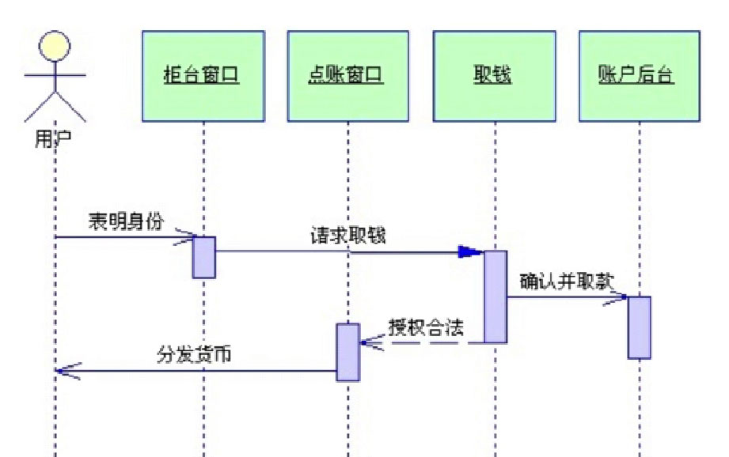

# UML

Unified Modeling Language（UML），统一建模语言或标准建模语言。

是一个支持模型化和软件系统开发的图形化语言。

为软件开发的所以阶段提供模型化和可视化支持。

### UML图示

UML 2.2一共定义了14中图示（diagrams）。

参考资料：

https://www.cnblogs.com/Ph-one/p/7650624.html

https://www.eclipse.org/modeling/mdt/downloads/?project=uml2

https://www.cnblogs.com/silent2012/archive/2011/09/07/2169946.html

### 常用UML图

用例图（The Use Case Diagram）

> [!TIP|style:plat|label:The Use Case Diagram]

> 用例图能够以可视化的方式，表达系统如何满足所收集的业务规则，以及特定的用户需求等信息。

序列图（The Sequence Diagram）

> [!TIP|style:plat|label:The Sequence Diagram]

> 序列图用于安装交互发生的一系列顺序，显示对象之间的这些交互。

类图（The Class Diagram）

> [!TIP|style:plat|label:The Class Diagram]

> UML类图、业务逻辑和所有支持结构一同被用于定义全部的代码结构。

UML建模工具

Microsoft Office Visio、Rational Rose、PowerDesign三种建模工具应用最广。

