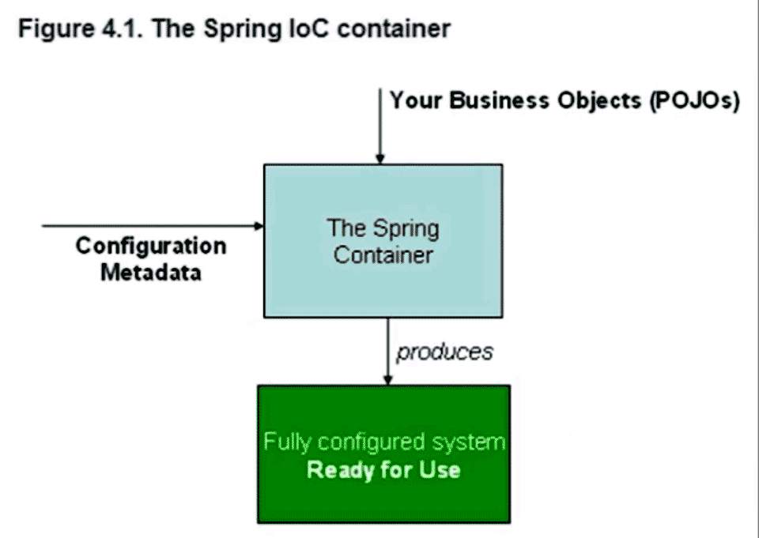

# IOC 控制反转

控制权的转移，应用程序本身不负责依赖对象的创建和维护，而是由外部容器负责创建和维护。

**DI(依赖注入Dependency Injection)**是其一种实现方式

**目的**创建对象并且组装对象之间的关系

比如我们住的房子，不会自己画图纸修建，而是之间找开发商或中介购买使用。

* 百度百科 https://baike.baidu.com/item/%E6%8E%A7%E5%88%B6%E5%8F%8D%E8%BD%AC/1158025

* 浅谈IOC--说清楚IOC是什么 https://blog.csdn.net/ivan820819/article/details/79744797

*  什么是IOC(控制反转)、DI(依赖注入) https://blog.csdn.net/qq_42709262/article/details/81951402